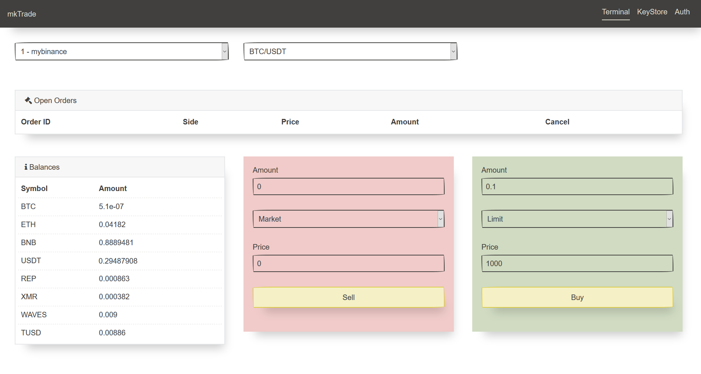

# mktrade
Yet another client for cryptocurrency exchanges

# Features
1. Support 133 cryptocurrency exchange
2. Encoded api keys storage
3. Support fetching balances, open orders, cancel orders and create orders
4. Work on all OS where work python in web browser

# How-To
1. git clone https://github.com/zzzzlzzzz/mktrade.git
2. python -m pip install -r requirements.txt
3. python main.py
4. Open browser and go to http://127.0.0.1:5005

# Screens

